# IAM Basics Lab - Solution

**Student Name:** Maryam Ahmadi 
**Date Completed:** 11.02.2026

---

## Exercise 1: IAM Groups

### Screenshots:
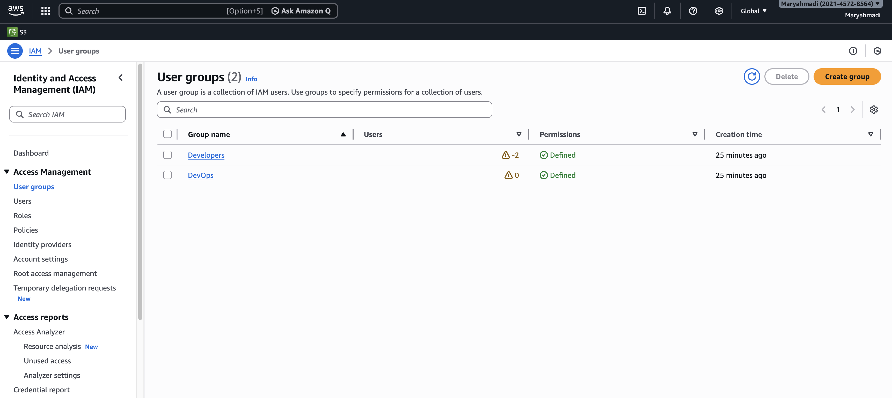

### Groups Created:
-  ✅ Developers group
-  ✅DevOps group


Explanation:

Groups were created to manage permissions at scale and avoid attaching policies directly to individual users. This follows IAM best practices.

---

## Exercise 2: Group Permissions

### Developers Group:
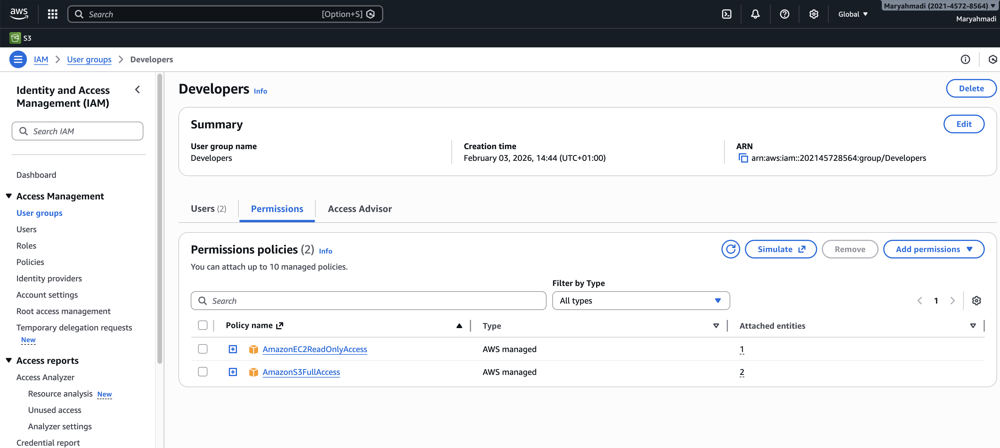

**Policies Attached:**
- AmazonS3FullAccess
- AmazonEC2ReadOnlyAccess

### DevOps Group:


**Policies Attached:**
- AmazonS3FullAccess
- AmazonEC2FullAccess

---

## Exercise 3: IAM Users

### Screenshots:
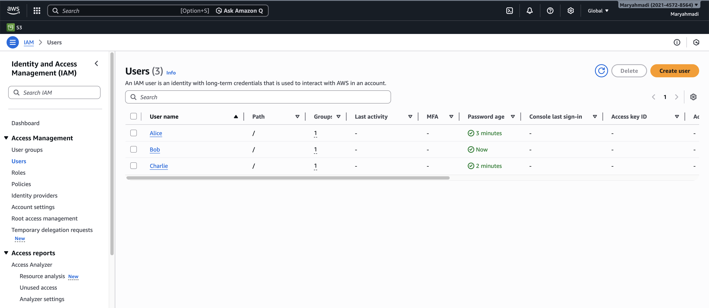

### Users Created:

| Username | Group | Console Access | Status |
|----------|-------|----------------|--------|
| alice | Developers | Yes | ✅ Created |
| bob | Developers | Yes | ✅ Created |
| charlie | DevOps | Yes | ✅ Created |


Notes:

All users were required to change password at first login.

Credentials were saved securely and not committed to GitHub.

credentials.txt was added to .gitignore.


---

## Exercise 4: Permission Testing

### Alice's Access Tests:

**S3 Access:**
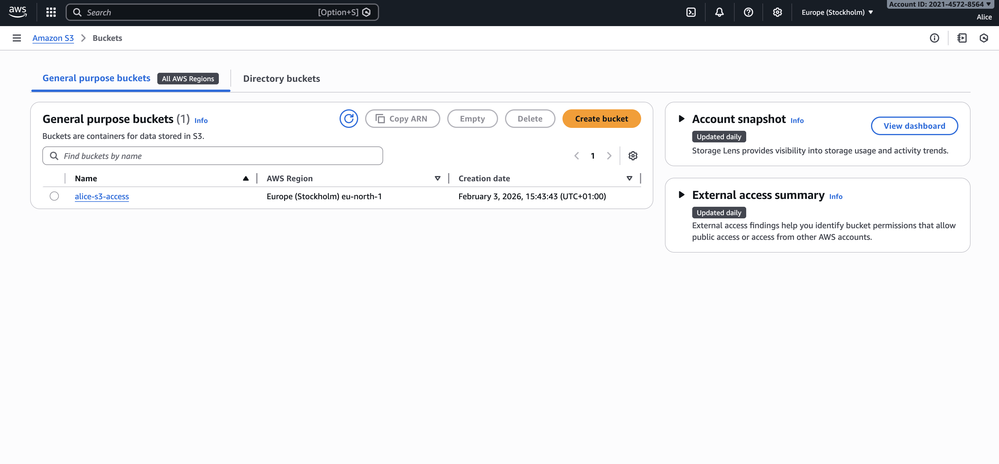
- Create bucket: ✅ SUCCESS
- Upload file: ✅ SUCCESS

**EC2 Access:**
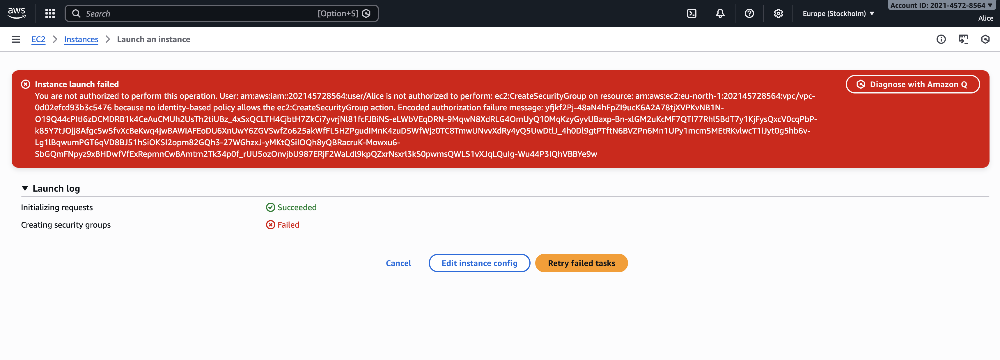
- View instances: ✅ SUCCESS
- Launch instance: ❌ DENIED (Expected)

Alice correctly has read-only EC2 permissions.


### Bob's Access Tests:

**S3 Access:**
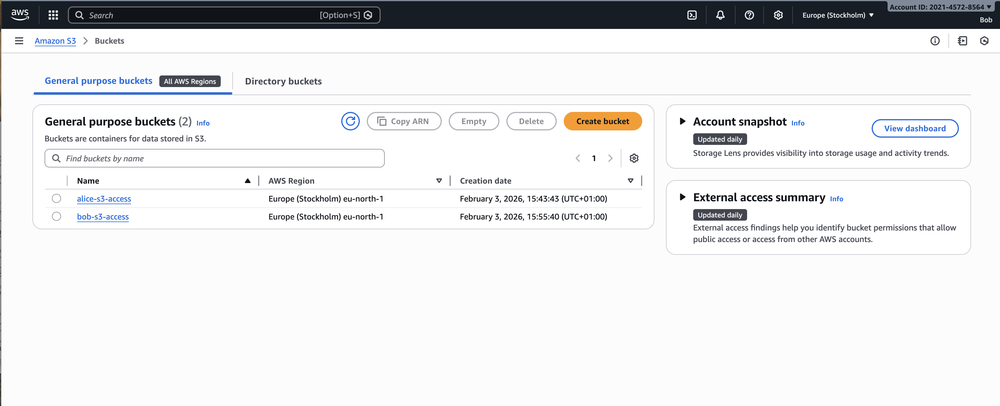
- Create bucket: ✅ SUCCESS

**EC2 Access:**
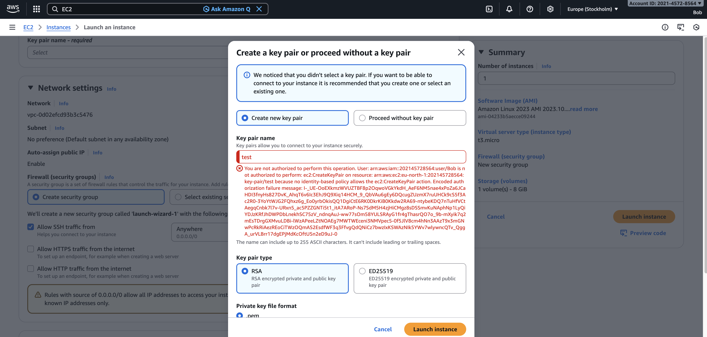
- View instances: ✅ SUCCESS
- Launch instance: ❌ DENIED (Expected)

Bob had the same permissions as Developers group before applying the custom policy.


### Charlie's Access Tests:

**Full Access:**
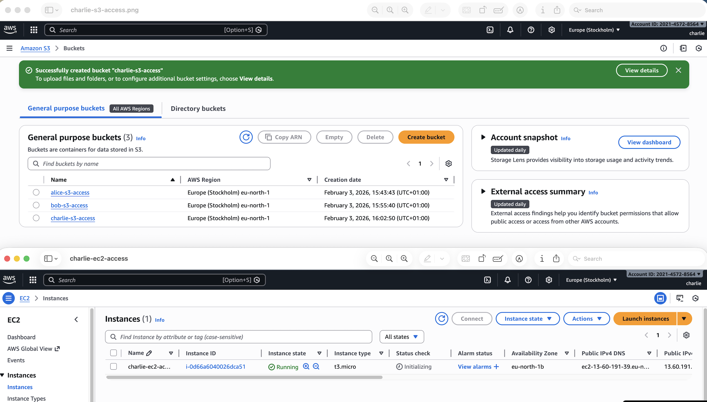
- S3 create bucket: ✅ SUCCESS
- EC2 launch instance: ✅ SUCCESS

Charlie (DevOps) has full EC2 and S3 access as expected.


### Summary of Test Results:

| User | S3 Full | EC2 View | EC2 Launch | Result |
|------|---------|----------|------------|--------|
| alice | ✅ | ✅ | ❌ | As expected |
| bob | ✅ | ✅ | ❌ | As expected |
| charlie | ✅ | ✅ | ✅ | As expected |

Access control worked correctly according to assigned group policies.

---

## Exercise 5: Custom Policy

### Policy JSON:
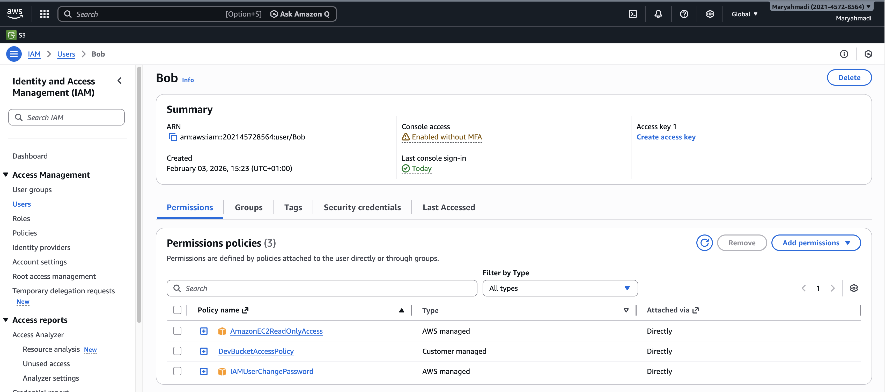

```json
{
    "Version": "2012-10-17",
    "Statement": [
        {
            "Sid": "ListAllBuckets",
            "Effect": "Allow",
            "Action": "s3:ListAllMyBuckets",
            "Resource": "*"
        },
        {
            "Sid": "DevBucketAccess",
            "Effect": "Allow",
            "Action": [
                "s3:ListBucket",
                "s3:GetObject",
                "s3:PutObject",
                "s3:DeleteObject"
            ],
            "Resource": [
                "arn:aws:s3:::dev-bucket",
                "arn:aws:s3:::dev-bucket/*"
            ]
        }
    ]
}
```


Changes Applied:

Removed AmazonS3FullAccess from Bob

Attached DevBucketAccessPolicy directly to Bob


### Custom Policy Test:
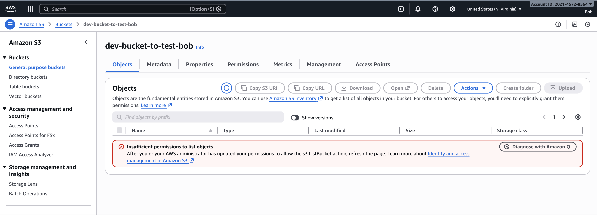

**Bob's Access After Custom Policy:**
- Access dev-bucket: ✅ SUCCESS
- Access other buckets: ❌ DENIED (Expected)

This successfully enforced the principle of least privilege.

---

## Exercise 6: MFA Configuration

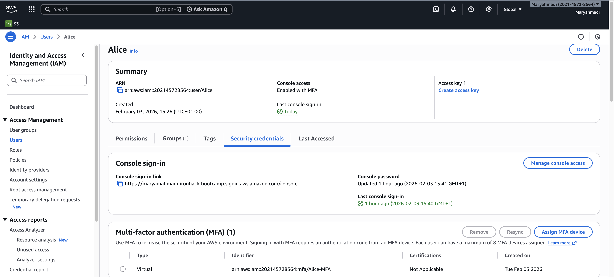

**MFA Details:**
- User: [alice / admin user]
- Device type: Virtual MFA
- Authenticator app: [Google Authenticator / Microsoft Authenticator / Authy]
- Status: ✅ Active


MFA was successfully configured and tested by logging out and logging back in.


---

## Bonus Challenges

### Challenge 1: Password Policy

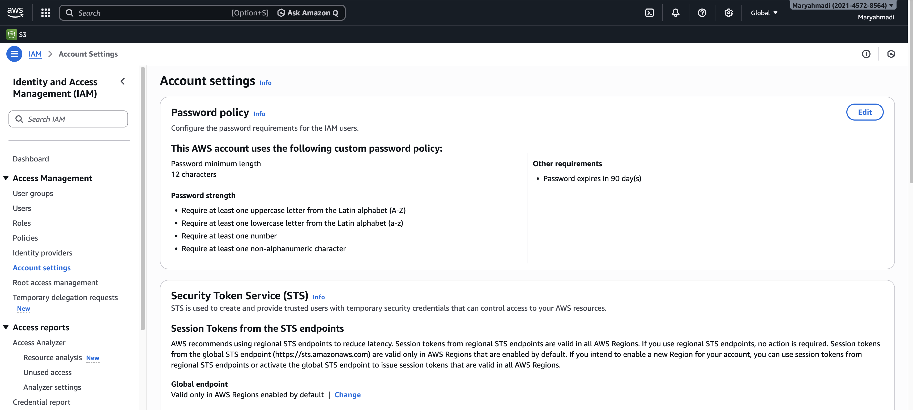

**Policy Settings:**
- ✅ Minimum length: 12 characters
- ✅ Require uppercase letters
- ✅ Require lowercase letters
- ✅ Require numbers
- ✅ Require symbols
- ✅ Password expiration: 90 days

This improves overall account security.

---

### Challenge 2: Access Analyzer

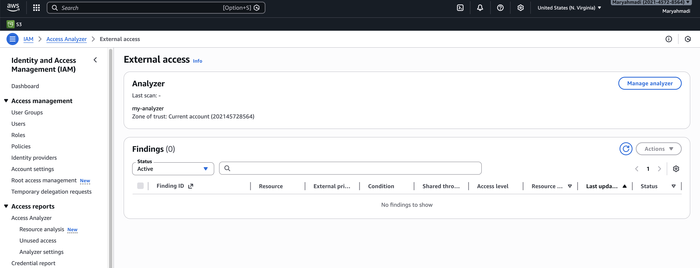

**Findings:**

- Number of findings: 0

- No public or cross-account access detected

- No critical security risks identified

Access Analyzer confirmed that no unintended public access exists

---

### Challenge 3: CLI Access Keys

**Alice Access Key Created:** Yes

**CLI Test Output:**
```bash
$ aws s3 ls --profile alice
2026-02-10  dev-bucket

The CLI configuration was successful and validated using aws s3 ls.
```

**Screenshot:** [If applicable]

---

## Reflection Questions

### 1. Why use groups instead of attaching policies directly to users?

**Your Answer:**

Using groups simplifies permission management. Instead of managing policies individually per user, permissions are assigned once to the group. This improves scalability, reduces configuration errors, and ensures consistency across team members. It also makes onboarding and offboarding easier.
---

### 2. What are the risks of giving everyone AdministratorAccess?

**Your Answer:**

Granting AdministratorAccess to all users creates serious security risks:

Accidental deletion of resources

Security misconfigurations

Increased blast radius if credentials are compromised

Compliance violations

No enforcement of least privilege

It removes accountability and increases operational risk.


---

### 3. How would you organize IAM for 50 developers across 5 projects?

**Your Answer:**

I would use a combination of:

Project-based groups (ProjectA-Developers, ProjectB-Developers)

Role-based access (ReadOnly, Developer, DevOps, Admin)

IAM roles instead of long-term credentials

Resource tagging to enforce project boundaries

Separate AWS accounts per project (recommended best practice)

This structure ensures scalability, isolation, and security

---

### 4. What happens if you delete an IAM user? Can you recover their permissions?

**Your Answer:**

Deleting an IAM user is permanent. The user and their credentials cannot be recovered.
However, if permissions were assigned via groups, recreating the user and re-adding them to the group restores their access quickly.

CloudTrail logs remain available for auditing past actions.

---

## Key Learnings

**What was most challenging about this lab?**

Designing and testing the custom S3 policy to ensure Bob could only access a single bucket while still being able to list buckets.

---

**What IAM best practice will you always follow?**

Apply the principle of least privilege and avoid using AdministratorAccess unless absolutely necessary.

---

**How does IAM help implement the principle of least privilege?**

IAM allows granular control over:

Specific services

Specific actions

Specific resources

Conditional access (IP, MFA, time, etc.)

This ensures users only have the minimum permissions required to perform their tasks, reducing security risk.

---

## Checklist

- ✅ All 3 users created (alice, bob, charlie)
- ✅ Both groups created (Developers, DevOps)
- ✅ Permissions tested for each user
- ✅ Custom policy created and tested
- ✅ MFA enabled for at least one user
- ✅ All screenshots captured
- ✅ All reflection questions answered
- ✅ Policy JSON file saved
- ✅ Work committed to Git
- ✅ Pull request created

---

**Completed By:** Maryam Ahmadi
**Date:** 11.2.2026
